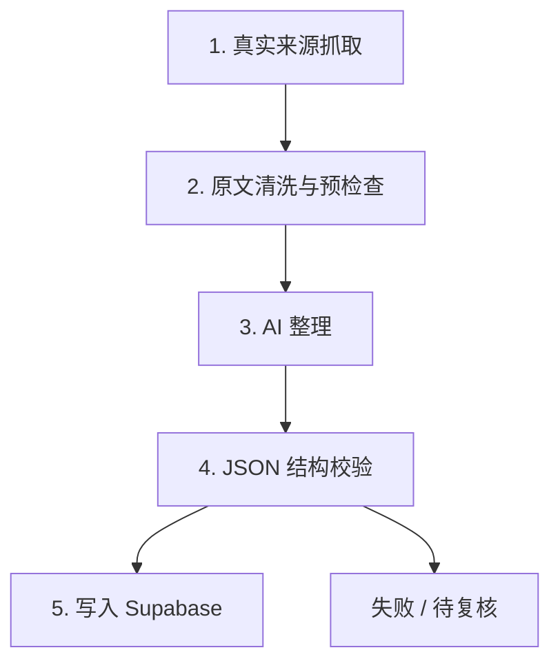

# AI 内容整理流程

## 目标

定义 `zoed.signal` 中 AI 的正确职责边界：

- 新闻事实来自真实来源
- AI 只负责整理和解释
- 模型不得编造事实字段

正式链路：

`真实新闻源 -> 抓取原文与元信息 -> AI 整理 -> 结构校验 -> 写入 Supabase`

## AI 不负责什么

AI 不负责：

- 凭空生成新闻
- 虚构标题
- 虚构来源
- 虚构链接
- 虚构日期
- 在缺少事实时“脑补”

如果抓取层没有拿到这些事实字段，流程应该进入失败或待复核，而不是让模型补齐。

## AI 负责什么

AI 可以负责：

- 摘要真实内容
- 判断重要性
- 归类到既定分类
- 生成标签
- 解释为什么重要
- 解释对商科学生有什么用
- 给出可执行的下一步建议

## 推荐流程



## 输入定义

AI 的输入必须包含真实来源字段：

```json
{
  "sourceTitle": "原始标题",
  "sourceName": "来源名",
  "sourceUrl": "https://example.com/article",
  "publishedAt": "2026-05-05",
  "content": "抓取到的正文或摘要",
  "fetchedAt": "2026-05-05T10:30:00Z"
}
```

## 输出定义

AI 的输出只补整理字段，事实字段原则上沿用抓取层数据：

```json
{
  "category": "AI 产品更新",
  "importance": "必看",
  "whatHappened": "发生了什么",
  "whyImportant": "为什么重要",
  "relevanceToBusinessStudents": "和商科学生的关系",
  "interviewOrCaseUse": "可用于面试 / 商赛",
  "nextAction": "下一步建议",
  "tags": ["企业AI", "商业化"]
}
```

最终写入对象由程序侧组装：

```json
{
  "id": "program-generated-id",
  "briefId": "editorial-assigned-brief-id",
  "title": "sourceTitle",
  "sourceName": "sourceName",
  "sourceUrl": "sourceUrl",
  "publishedAt": "publishedAt",
  "category": "AI output",
  "importance": "AI output",
  "whatHappened": "AI output",
  "whyImportant": "AI output",
  "relevanceToBusinessStudents": "AI output",
  "interviewOrCaseUse": "AI output",
  "nextAction": "AI output",
  "tags": ["AI output"],
  "savedType": []
}
```

## 校验要求

写入前必须校验：

- `title` 非空
- `sourceName` 非空
- `sourceUrl` 是合法 URL
- `publishedAt` 是合法日期
- `category` 在允许枚举中
- `importance` 在允许枚举中
- 长文本字段非空

## 失败策略

以下情况不能放行：

- 原文缺失
- 来源字段缺失
- AI 输出不是合法 JSON
- AI 给出的枚举值不合法
- AI 试图覆盖真实来源字段

处理方式：

- 标记失败
- 不写入正式库
- 交给上游流程重试或人工复核

## 当前线程的结论

为了避免方向跑偏，这条线程默认采用以下结论：

1. AI 整理不是 AI 生成新闻
2. 事实字段优先级永远高于模型输出
3. 本地 JSON 不是正式数据 fallback
4. 正式展示只信任 Supabase 中通过校验的数据
