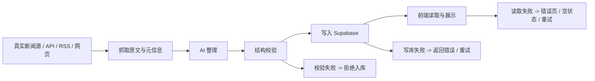

# 数据写入与前台展示闭环

## 目标

确保这条正式产品链路真实、可控、可观测：

`真实新闻源 -> 抓取/获取原文与元信息 -> AI 整理 -> 结构校验 -> 写入 Supabase -> 前端展示`

关键原则：

- AI 不负责“生成新闻”，只负责整理真实新闻
- `title`、`sourceName`、`sourceUrl`、`publishedAt` 等事实字段必须来自真实来源
- Supabase 是正式环境唯一业务数据源
- 本地 JSON 仅用于开发测试和 demo，不作为正式 fallback 混入真实新闻流

## 端到端数据流

### 1. 抓取层

抓取层负责拿到真实世界中的原始事实：

- 原始标题
- 来源名
- 原文 URL
- 发布时间
- 正文内容或正文摘要
- 抓取时间

这层不做价值判断，只做事实采集。

### 2. AI 整理层

AI 只整理，不编造。

允许 AI 负责的字段：

- `whatHappened`
- `whyImportant`
- `relevanceToBusinessStudents`
- `interviewOrCaseUse`
- `nextAction`
- `category`
- `importance`
- `tags`

不允许 AI 自由编造的字段：

- `title`
- `sourceName`
- `sourceUrl`
- `publishedAt`

如果需要“标准化标题”，也只能在原始标题基础上做轻微清洗，不能改变事实含义，更不能凭空补写来源或日期。

### 3. 结构校验层

所有 AI 整理后的对象在写入前必须经过服务端校验。

校验覆盖：

- 必填字段是否存在
- 事实字段格式是否合法
- 枚举值是否合法
- 关联对象是否存在
- 数组字段是否去重与裁剪

不通过时：

- 返回 `400`
- 不写入数据库
- 保留错误信息，供上游流程重试或人工处理

### 4. 持久化层

正式数据写入 Supabase。

原则：

- 读写都以 Supabase 为准
- 写入失败直接报错，不偷偷改写本地 JSON
- 本地 JSON 只能在开发时显式开启 mock 模式使用

### 5. 前端展示层

前端页面只读取通过校验后的业务数据。

页面包括：

- 首页
- 简报详情页
- 素材库

如果 Supabase 读取失败：

- 不展示本地 demo 数据伪装成真实内容
- 应显示错误提示、空状态或重试机制

## API 设计

### `GET /api/briefs`

- 用途：读取简报列表
- 数据源：Supabase 或开发 mock 模式

### `POST /api/briefs`

- 用途：创建简报
- 校验：必填字段 + ID 冲突检查

### `PUT /api/briefs/:id`

- 用途：更新简报
- 校验：对象必须存在

### `DELETE /api/briefs/:id`

- 用途：删除简报
- 校验：该简报下不能还有关联新闻

### `GET /api/news`

- 用途：读取新闻列表
- 只返回通过 sanitize 的记录

### `POST /api/news`

- 用途：写入单条新闻
- 规则：
  - 事实字段必须已由抓取层提供
  - 服务端校验全部字段
  - `briefId` 必须存在

### `PUT /api/news/:id`

- 用途：更新新闻
- 规则：
  - 新闻必须先存在
  - 更新后仍需通过校验
  - `briefId` 仍需存在

### `DELETE /api/news/:id`

- 用途：删除新闻

### `GET /api/bookmarks`

- 用途：读取素材库收藏

### `POST /api/bookmarks`

- 用途：新增收藏
- 校验：`newsId` 存在，`bucket` 合法

### `DELETE /api/bookmarks/:newsId?bucket=...`

- 用途：删除收藏
- 校验：`bucket` 合法

## 后台写入方案

### 正式模式

- 必须连接 Supabase
- `saveNewsItem` / `saveBrief` / `addBookmark` 全部写 Supabase
- 任何写入失败都直接抛错

### 开发 mock 模式

仅当同时满足以下条件时允许使用本地 JSON：

- `NODE_ENV !== "production"`
- `ZOED_ALLOW_LOCAL_DATA=true`
- 且没有配置 Supabase

这样可以避免未来把 demo 数据策略误带进正式产品。

## 前台读取策略

### 首页

读取：

- `getBriefs()`
- `getNewsItems()`

策略：

- 正式环境优先且只读 Supabase
- Supabase 失败时进入错误提示，而不是回退本地数据

### 简报详情页

读取：

- `getBriefById(id)`
- `getNewsForBrief(id)`

策略：

- 简报不存在返回 `notFound`
- 可选字段缺失使用 fallback 文案

### 素材库

读取：

- `getBookmarks()`
- `getNewsItems()`

策略：

- 如果 bookmark 对应新闻不存在，则忽略该收藏项
- 不让脏数据把整个页面搞坏

## 错误兜底方案

### 1. 字段缺失

- 写入前发现必填缺失：拒绝入库
- 读取历史脏数据：跳过坏记录
- 可选字段缺失：页面显示兜底文案

### 2. 写库失败

- API 返回 `500`
- 不自动降级写本地 JSON
- 上游自动化线程应决定是否重试或进入人工复核

### 3. Supabase 读取失败

- 不展示本地 demo 数据
- 前端显示错误页 / 重试按钮 / 空状态

### 4. 脏数据防护

防线分三层：

1. API 校验
2. 数据读取 sanitize
3. 展示层 fallback

## 测试清单

### API 校验

- `POST /api/news` 缺 `title` 返回 `400`
- `POST /api/news` 传非法 `sourceUrl` 返回 `400`
- `POST /api/news` 传非法 `publishedAt` 返回 `400`
- `POST /api/news` 传不存在的 `briefId` 返回 `400`
- `PUT /api/news/:id` 更新不存在新闻返回 `404`
- `POST /api/briefs` 传重复 `id` 返回 `409`
- `DELETE /api/briefs/:id` 在还有关联新闻时返回 `409`
- `POST /api/bookmarks` 传不存在的 `newsId` 返回 `400`

### 正式数据源策略

- 配置 Supabase 后，读取新闻只从 Supabase 获取
- 配置 Supabase 后，读取失败应进入错误页，不应回退本地 JSON
- 配置 Supabase 后，写入失败不应写本地 JSON

### 开发 mock 模式

- 未配置 Supabase 且 `ZOED_ALLOW_LOCAL_DATA=true` 时，可正常读写 `data/*.json`
- 未配置 Supabase 且未开启 mock 时，应直接报配置错误

### 前台展示

- 页面在存在一条脏记录时仍可打开
- 日期字段异常时不显示 `Invalid Date`
- 素材库中若 bookmark 指向已删除新闻，不应导致页面异常

## 与其他线程的协作边界

- 抓取线程：负责真实来源抓取与原文/元信息获取
- AI 处理线程：负责基于真实来源做整理，不编造事实字段
- Supabase 线程：负责表结构、约束、迁移和正式持久化
- 当前线程：负责 API、校验、写入闭环、前端读取和错误兜底

## 推荐下一步

最适合继续推进的两件事：

1. 增加专用的自动化写入口，例如 `/api/pipeline/news/import`
2. 在 Supabase 层补充状态字段，例如 `needs_review`、`ingested_at`、`source_trace`
